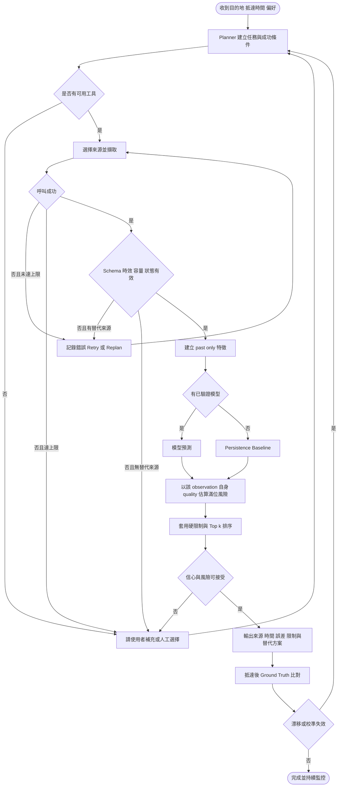

# Agent 執行流程

```mermaid
flowchart TD
    A([收到目的地 抵達時間 偏好]) --> B[Planner 建立任務與成功條件]
    B --> C{是否有可用工具}
    C -->|否| H[請使用者補充或人工選擇]
    H --> B
    C -->|是| D[選擇來源並擷取]
    D --> E{呼叫成功}
    E -->|否且未達上限| F[記錄錯誤 Retry 或 Replan]
    F --> D
    E -->|否且達上限| H
    E -->|是| G{Schema 時效 容量 狀態有效}
    G -->|否且有替代來源| F
    G -->|否且無替代來源| H
    G -->|是| I[建立 past only 特徵]
    I --> J{有已驗證模型}
    J -->|是| K[模型預測]
    J -->|否| L[Persistence Baseline]
    K --> M[以該 observation 自身 quality 估算滿位風險]
    L --> M
    M --> N[套用硬限制與 Top k 排序]
    N --> O{信心與風險可接受}
    O -->|否| H
    O -->|是| P[輸出來源 時間 誤差 限制與替代方案]
    P --> Q[抵達後 Ground Truth 比對]
    Q --> R{漂移或校準失效}
    R -->|是| B
    R -->|否| S([完成並持續監控])
```

決策、迴圈、例外、人工互動與事後驗證均與架構及 `ParkingAgent.run` 一致。

